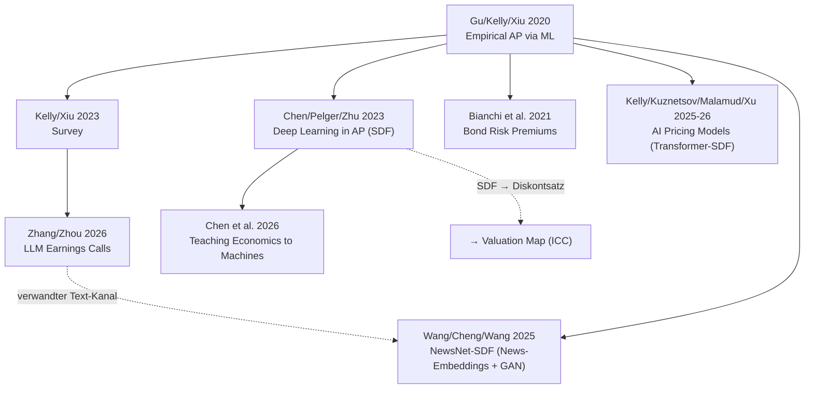

# Asset Pricing Literature Map

**Lesart:** Fundament [[Empirical Asset Pricing via Machine Learning]] → Überblick [[Financial Machine Learning (Survey)]] → Struktur-Linie [[Deep Learning in Asset Pricing]]/[[Teaching Economics to the Machines]] → Text-Linie [[LLMs for Asset Pricing – Earnings Calls]] → Fremdkapital [[Bond Risk Premiums with Machine Learning]] → zwei konkurrierende SDF-Deep-Learning-Hebel: Cross-Asset-Attention [[Artificial Intelligence Asset Pricing Models]] vs. News-Text-Embeddings [[NewsNet-SDF]] (Provenienz deutlich niedriger, arXiv-Preprint ohne Top-Uni-Zugehörigkeit).
**Brücke zur WU-Agenda:** [[Stochastischer Diskontfaktor]] → [[Discount Rate Estimation]] → [[Valuation Literature Map]] · Gaps: [[Gaps – Asset Pricing]]
