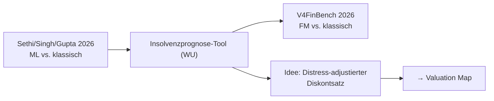

# Bankruptcy Prediction Literature Map

Kleiner, aber strategisch zentraler Cluster: [[Insolvenzprognose-Tool (WU)]] als Asset, [[V4FinBench]] als externe Messlatte, [[Predicting Financial Distress Using Machine Learning Techniques]] als aktueller Stand klassischen MLs. Die Wertschöpfung liegt in der Brücke: [[Distress-adjustierter Diskontsatz]] · [[Explainable Bankruptcy Prediction für Auditing]] · Gaps: [[Gaps – Bankruptcy Prediction]]
