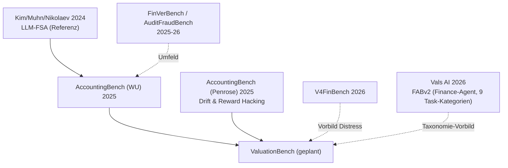

# Benchmark Literature Map (Cluster A + Benchmark-Welle)

**Story:** [[Financial Statement Analysis with Large Language Models]] beweist die Fähigkeit → [[AccountingBench (WU)]] misst sie systematisch → [[AccountingBench (Penrose)]] zeigt die Langzeit-Schwäche ([[Benchmark Drift und Reward Hacking]]) → [[ValuationBench]] besetzt die Bewertungslücke, bevor es andere tun ([[Trend – Financial Benchmarks]], Umfeld: [[FinVerBench und AuditFraudBench]], [[V4FinBench]], [[Finance Agent Benchmark v2 (FABv2)]] als Praktiker-validierte Taxonomie-Blaupause).
Gaps: [[Gaps – Financial Statement Analysis]]

## Verwandte Notizen
- [[Br+ѮIm]]
