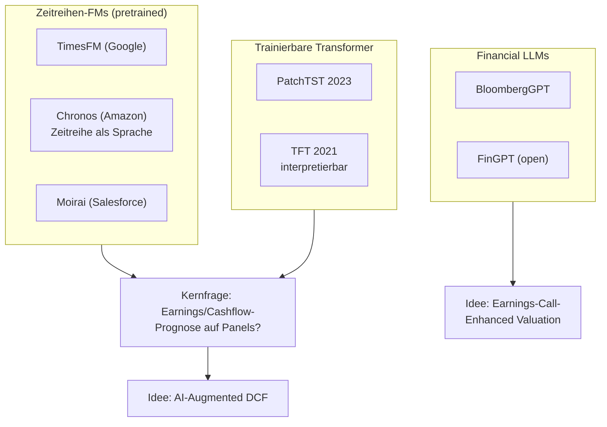

# Foundation Model Literature Map

Alle Einträge Status **„zu prüfen"** – der explorative Cluster. Reihenfolge: [[Chronos]] & [[TimesFM]] zuerst testen (Zero-Shot billig), [[Temporal Fusion Transformer]] für die interpretierbare Eigenbau-Linie, [[FinGPT]] für Text.
Papers: [[Moirai]] · [[PatchTST]] · [[BloombergGPT]] · Gaps: [[Gaps – Foundation Models]] · Ideen: [[Time-Series Foundation Models für Earnings-Prognose]], [[Zero-Shot vs Fine-Tuned Foundation Models auf Fundamentaldaten]]
