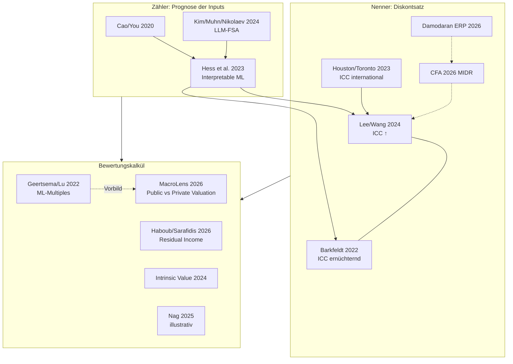

# Valuation Literature Map

**Zentrale Spannung:** [[Earnings Forecast Accuracy and Implied Cost of Capital]] (optimistisch) vs. [[The Implied Cost of Capital – A Machine Learning Approach]] (ernüchternd) → Forschungsfenster.
**Papers:** [[Fundamental Analysis via Machine Learning]] · [[Interpretable Machine Learning for Earnings Forecasts]] · [[Relative Valuation with Machine Learning]] · [[Residual Income Valuation and Stock Returns]] · [[Intrinsic Value]] · [[ML Earnings Forecasting und ICC International]] · [[What the Market Knows That WACC Doesn't (MIDR)]] · [[Equity Risk Premiums 2026 und Cost of Capital by Industry]] · [[AI-Enhanced Valuation – ML Forecasts in DCF und LBO]] · [[MacroLens]] (Public-vs-Private-Valuation-Benchmark, direktes Vorbild für [[ValuationBench]]) · Gaps: [[Gaps – Valuation und Diskontsatz]]
